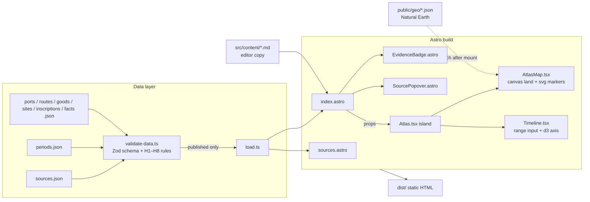

# Architecture

Kalinga: Ancient Trade Routes is a static site. There is no server and no database. Historical content is JSON validated at build time; the only client-side JavaScript is the atlas island (map + timeline).

## System view



## Principles

1. **No source, no render.** `validate-data.ts` runs before every build and fails on any `reviewed`/`published` entry that breaks a sourcing rule. `load.ts` then filters to `published`. Two independent gates.
2. **Content pages ship zero JS.** Astro renders everything static. Only `Atlas.tsx` hydrates, and only when scrolled into view.
3. **The map is data-driven SVG over a canvas basemap.** No tile server. Land and rivers are one public-domain TopoJSON file each, fetched lazily. Ports and routes are SVG so they are focusable and labelled.
4. **Evidence is visible everywhere.** Any component that shows a historical claim composes `EvidenceBadge` and `SourcePopover`. There is no other way to render a claim.

## Folder layout

| Path | Purpose |
|---|---|
| `src/data/schema.ts` | Zod schema; the single definition of every entity. |
| `src/data/*.json` | Historical data. `sources.json` is CSL-JSON. |
| `src/data/load.ts` | Build-time accessors that return published entries only. |
| `src/data/cite.ts` | Citation formatting shared by components and the Sources page. |
| `src/components/` | Static Astro components. |
| `src/islands/` | React islands (the only client JS). |
| `src/layouts/Base.astro` | Document skeleton, landmarks, footer attribution. |
| `src/pages/` | `index.astro` (all sections + atlas), `sources.astro` (bibliography). |
| `src/content/` | Editor's narrative Markdown. |
| `src/styles/tokens.css` | Design tokens and base styles. |
| `src/assets/` | Original SVG illustrations (CC BY-SA). |
| `scripts/` | `validate-data.ts`, `readability.ts`, `fetch-geo.ts`. |
| `public/geo/` | Generated Natural Earth TopoJSON (gitignored). |
| `src/assets/fonts/` | Self-hosted OFL fonts. |
| `docs/` | This file, design specs, research notes, audit reports. |
| `.claude/` | Agents, skills and path-scoped rules for Claude Code. |

## Data lifecycle

```
researcher writes draft ──▶ human reviews ──▶ status: reviewed ──▶ human publishes ──▶ status: published ──▶ rendered
        │                                                                                     ▲
        └── validate-data warns on drafts, errors on reviewed/published ──────────────────────┘
```

Local preview of unpublished entries: `PUBLIC_SHOW_DRAFTS=true npm run dev` (dev only; production builds ignore the flag).

## Agent workflow

The main Claude Code session orchestrates via `/phase <name>`. Sub-agents in `.claude/agents/` own one phase each and are constrained by preloaded skills and the same validators the build uses. See `CLAUDE.md`.

## Deployment

`npm run build` → `dist/`. Any static host. No environment variables are required in production. The site sets no cookies and loads nothing from third parties.
